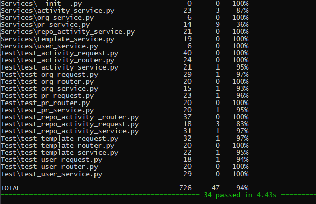

# Reporte de Pruebas Unitarias

## Introducción
Este informe documenta los resultados de las pruebas unitarias realizadas sobre el sistema. para verificar su correcto funcionamiento y comportamiento esperado.

## Resumen de Resultados

| Pruebas unitarias resumen | Resultado |
|---------------------------|-----------|
| # Pruebas Pasadas         | 34        |
| # Pruebas fallidas        | 0         |
| % Covertura del código     | 94%       |
| Total de pruebas realizadas | 34       |
| Herramienta utilizada | Pytest       |

